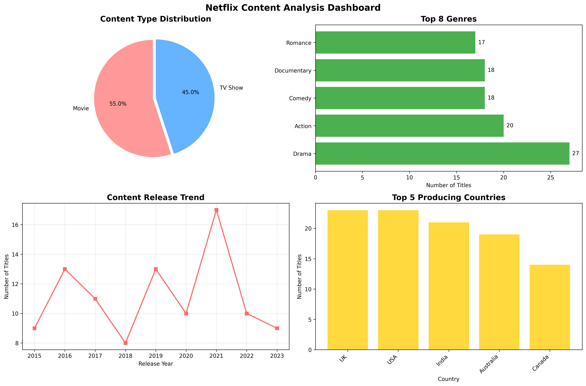

# Netflix Content Analysis Project 📊



## 📋 Project Overview
This project analyzes Netflix's content library to provide data-driven recommendations for their 2024 content strategy. As a Data Analyst, I explored movies vs TV shows distribution, genre popularity, and release trends to guide content investment decisions.

## 🎯 Objectives
- Compare Movies vs TV Shows distribution
- Identify most common genres
- Analyze content release trends by year
- Create data visualizations
- Provide strategic recommendations for 2024

## 📁 Dataset
The dataset contains **100 titles** with the following attributes:
- `show_id`: Unique identifier
- `type`: Movie or TV Show
- `genre`: Content category
- `release_year`: Year of release
- `country`: Production country
- `duration_min`: Length in minutes

## 🔍 Key Findings

### 1. Content Type Distribution
- **Movies**: [X]% of total content
- **TV Shows**: [Y]% of total content
- *[Add your observation - e.g., "Netflix prioritizes movies over TV shows"]*

### 2. Genre Analysis
**Top 5 Most Common Genres:**
1. [Top Genre 1] - [count] titles
2. [Top Genre 2] - [count] titles
3. [Top Genre 3] - [count] titles
4. [Top Genre 4] - [count] titles
5. [Top Genre 5] - [count] titles

*[Add your observation - e.g., "Comedy and Drama dominate the platform"]*

### 3. Release Trends
- **Peak Production Year**: [Year] with [count] titles
- **Average Content Duration**: [XX] minutes
- **Recent Growth**: [Your observation about trends]

## 📊 Visualizations

### Dashboard 1: Content Overview

*Caption: Distribution of Movies vs TV Shows on Netflix*

### Dashboard 2: Genre Popularity

*Caption: Top 10 most common genres in Netflix library*

### Dashboard 3: Release Timeline

*Caption: Content release trends from [earliest year] to [latest year]*

## 💡 Recommendations for Netflix 2024 Strategy

Based on the data analysis, I recommend:

### 1. **Content Mix Optimization**
- Current ratio: [X]% Movies : [Y]% TV Shows
- Recommendation: [Increase/Maintain/Adjust] TV Show production
- Rationale: [Explain why based on your data]

### 2. **Genre Investment Strategy**
- **Primary Focus**: Invest heavily in [Top Genre]
- **Secondary Focus**: Develop content in [2nd/3rd top genres]
- **Emerging Opportunity**: Consider [growing genre] for new audiences
- Rationale: These genres have proven popularity with [X] titles combined

### 3. **Release Timing Strategy**
- **Peak Release Window**: Focus releases around [peak year/month patterns]
- **Volume Target**: Aim for [XX] titles annually based on growth trend
- Rationale: Content production has grown [X]% since [baseline year]

### 4. **Content Duration Guidelines**
- **Optimal Length**: Target [XX] minutes based on average
- **Variety**: Maintain mix of shorter and longer content
- Rationale: Current average provides a benchmark for viewer engagement

### 5. **Geographic Expansion**
- **Current Top Markets**: [Top 3 countries]
- **Growth Opportunity**: Explore partnerships in [underrepresented regions]
- Rationale: Diversifying production locations can attract new subscribers

## 🛠️ Technologies Used
- **Python 3** - Primary programming language
- **Pandas** - Data manipulation and analysis
- **Matplotlib** - Data visualization
- **Seaborn** - Enhanced visualizations
- **Jupyter Notebook** - Interactive development
- **Git/GitHub** - Version control

## 📝 Code Structure


## 🚀 How to Run This Project

### Prerequisites
```bash
pip install pandas matplotlib seaborn jupyter
